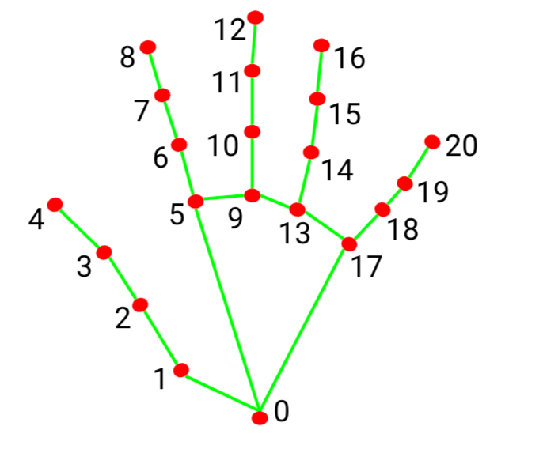
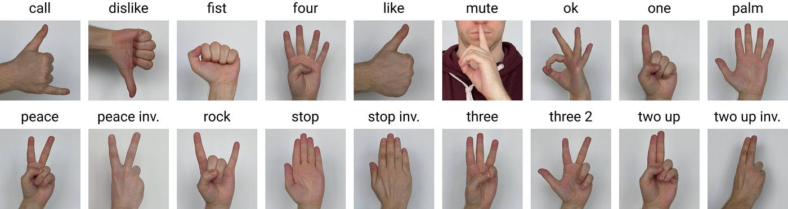
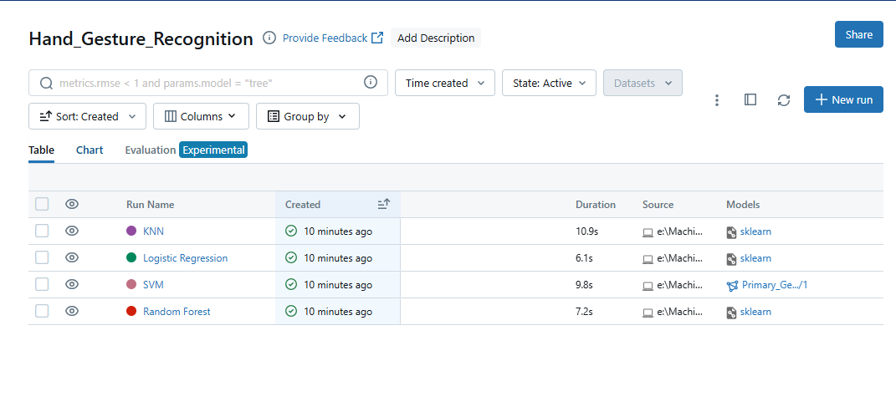
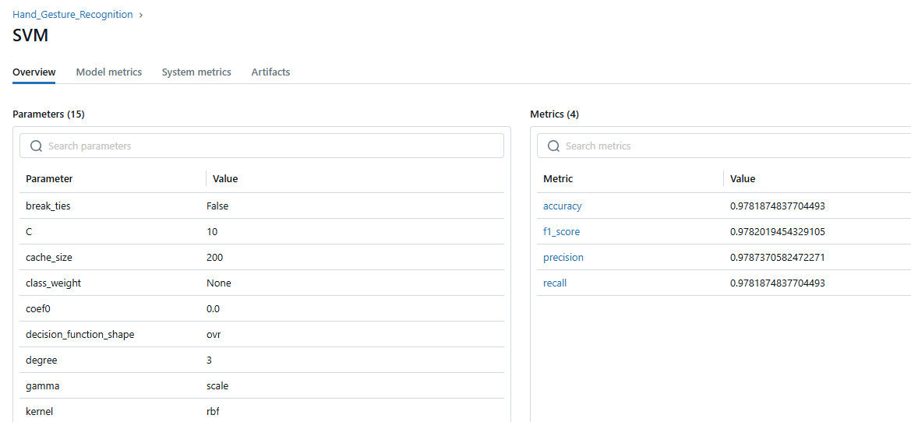
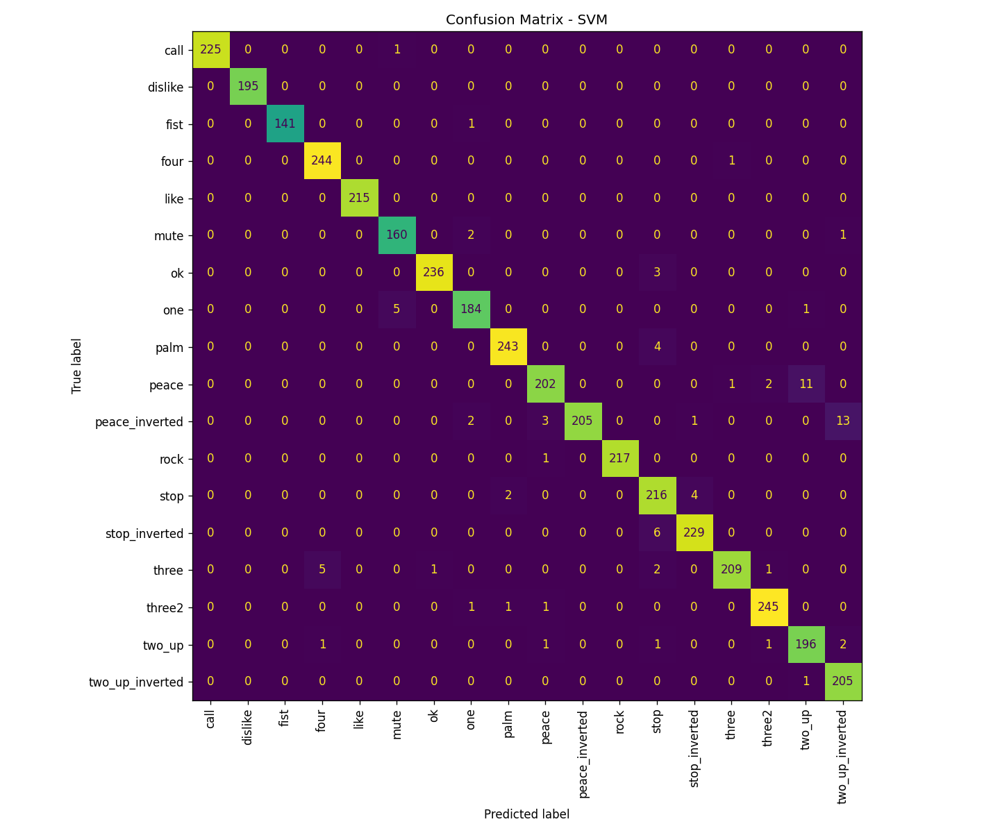

# Hand Gesture Recognition System

This repository contains a machine learning pipeline for real-time hand gesture classification using MediaPipe and Scikit-Learn. The project handles coordinate extraction, scale-invariant normalization, model training, MLflow tracking, and live video inference.

## Project Structure
```
hand-gesture-recognition/
├── 📁 data/                             # 25,000+ gesture samples
│   └── hand_landmarks_data.csv          (63 normalized coordinates)
│
├── 📁 models/                           # Trained SVM model for
│   └── deploy_svm.pkl                   production inference
│
├── 📁 notebooks/                        # Complete ML pipeline 
│   └── Hand_Landmarks.ipynb              & analysis
│
├── 📁 src/                              # Real-time webcam
│   ├── live_inference.py                gesture classification
│   └── mlflow_utils.py                  MLflow tracking utilities
│
├── 📁 assets/
│   ├── landmarks.png                    # Hand pose visualization
│   ├── hand_gestures.jpg                # 18 gesture classes overview
│   └── mlflow_screenshots/              # MLflow visualizations
│       ├── 1_runs_list.png
│       ├── 2_comparison_chart.png
│       ├── 3_svm_metrics.png
│       ├── 4_confusion_matrix.png
│       ├── 5_accuracy_f1_comparison.png
│       ├── 5_model_registry.png
│       └── 6_precision_recall_comparison.png
│
├── 📁 mlruns/                           # MLflow tracking (auto-generated)
├── requirements.txt                     # Python dependencies
├── README.md                            # This file
└── .gitignore                           # Git configuration
```

## Project Architecture
* **Data Processing & Training:** Handled entirely within `notebooks/Hand_Landmarks.ipynb`. For ease of testing and debugging, **every model (SVM, Random Forest, KNN, Logistic Regression) can be run separately on its own individual cell**.
* **Live Inference:** Decoupled into a standalone script (`src/live_inference.py`) to bypass Jupyter's GUI thread limitations and ensure maximum hardware FPS during live predictions.
* **MLflow Experiment Tracking:** Integrated with `src/mlflow_utils.py` for comprehensive parameter, metrics, and artifact logging.

## Data Overview
The dataset contains 25,000+ real-world hand gesture samples with 21 MediaPipe landmarks (63 3D coordinates) per sample. Each gesture has been geometrically normalized to be position-invariant and scale-invariant.

| Hand Landmarks | 18 Gesture Classes |
|:---:|:---:|
|  |  |

## Dataset & Normalization
To ensure the model is robust to distance and hand size in the live video feed, strict geometric normalization is applied to the 21 3D landmarks (63 features):
1. **Translation:** The Wrist (Landmark 0) is shifted to the origin $(0,0,0)$.
2. **Scale Invariance:** All coordinates are divided by the Euclidean distance between the Wrist and the Middle Finger Tip (Landmark 12).

## Model Evaluation & Selection
Four classifiers were evaluated. Support Vector Machine (SVM) was selected as the primary production model due to its superior generalization on the unseen test dataset.

For reproducibility, each model's training loop is isolated in its own execution cell within the main Jupyter Notebook.

| Model | Accuracy | Precision | Recall | F1-Score |
| :--- | :---: | :---: | :---: | :---: |
| **SVM (Deployed)** | **0.9781** | **0.9787** | **0.9781** | **0.9782** |
| Random Forest | 0.9771 | 0.9774 | 0.9771 | 0.9772 |
| KNN | 0.9771 | 0.9774 | 0.9771 | 0.9772 |
| Logistic Regression | 0.8875 | 0.8881 | 0.8875 | 0.8873 |

*Note: Minor metric variance is expected depending on hardware-specific random seed initialization.*

## MLflow Experiment Tracking
The training pipeline is fully integrated with MLflow to track parameters, metrics, artifacts (confusion matrices), and model versioning.

### Experiment Runs & Metrics



### Model Comparison


### Artifacts & Model Registry



## Live Demo Video
[Watch the real-time inference submission video here](https://drive.google.com/file/d/1YsMbZnnWIRYgRmTTlEsJ8tisZsCCEbAw/view?usp=sharing)

## Execution Instructions
1. Unzip the project and activate the virtual environment.
2. Run `notebooks/Hand_Landmarks.ipynb` to process data and generate `models/deploy_svm.pkl`.
3. Execute `python src/live_inference.py` in the terminal to launch the real-time classification feed.